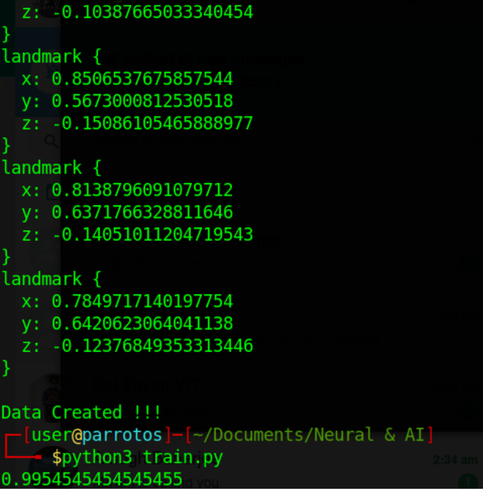

# Sign Language Interpreter with OpenCV and Support Vector Machine

## Overview
This project is a Sign Language Interpreter that utilizes OpenCV for image processing and Support Vector Machine (SVM) for classification. The process involves collecting hand signing data, generating a dataset, training a model, and testing the interpreter in real-time.


## Installation
Clone the Repository
```git
git clone https://github.com/adi-mj/sign-language-interpreter-opencv.git
```
Install Dependencies
```git
pip install -r requirements.txt
```

### How to Use


1. Collecting Hand Signing Data

    Use collect_images.py to gather multiple frames for different hand signs.
    Modify the 'Class' variable to define the identification for the signed data (e.g., 'a' or 'cow').
    Add various classes to the DATASET directory.

2. Generate Dataset

    Run generate.py to create a properly formatted CSV file.
    Change the variable file_name to set the name of the CSV file (default: dataset.csv).
3. Train the 

    Execute train.py to create a model.pkl file.
    The script also prints the accuracy of the model based on the training data.
4. Test the Interpreter

    Utilize test.py to observe how the model responds in real-time.
    Ensure good lighting and a clear view of hand gestures while testing.

### Accuracy


### Files in the Repository
collect_images.py   : Collects multiple frames for data collection.

generate.py         : Generates a CSV file with image path and class mapping.

train.py            : Trains the Support Vector Machine model and creates model.pkl.

test.py             : Tests the model in real-time using the webcam.

model.pkl           : A trained model for you to try out test.py (replace `with open('<model.pkl>', 'rb') as f:` in test.py to use your own)